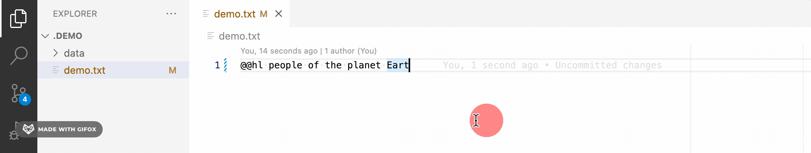
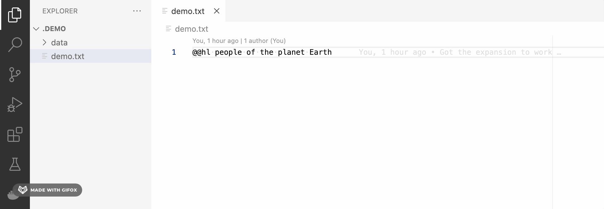

# Frontend

This is the frontend of the tool.  
Implemented as a VS Code extension in [`Elm`](https://elm-lang.org/).

## Architecture

This is an approximate illustration of the setup of the extension.

1. VS Code interface is connected to a thin JS-based client.
2. This JS client connects itself to the background Elm workers.
3. The Elm workers manage the incoming calls to perform the `shorthndr` tasks.
   1. Since interacting with _child_ processes from Elm is quite tricky,
      the `shorthndr` CLI tool is also wrapped into a small JS client used as
      a "side-car" for the Elm workers.

> The illustration below might be out of date, but should give a basic idea.

```plaintext
| ======= |
| VS Code |
| ======= |
     A
     |
     V
| ============== |                                   | ================== |                                   | ================= |
| EXTENSION [Js] |                                   | ExpandWorker [Elm] |                                   | ShortHndrCli [Js] |
| ~~~~~~~~~~~~~~ |                                   | ~~~~~~~~~~~~~~~~~~ |                                   | ~~~~~~~~~~~~~~~~~ |
| commands       |                                   | ports              |                                   | child_process     |
|                | -[listen]-> (toExtensionSuccess)= |                    |                                   |                   |
|                | -[listen]---> (toExtensionError)= |                    | =(toShortHndr) <--------[listen]- |                   |
|                | -[listen]----> (toExtensionInfo)= |                    | =(fromShortHndrSuccess) <-[send]- |                   |
|                | -[send]--------> (fromExtension)= |                    | =(fromShortHndrError) <---[send]- |                   |
|                | -[send]--> (fromExtensionExpand)= |                    |                                   | ================= |
| ============== |                                   | ================== | 
```

## Directory setup

- `src/` - contains all the Elm components
- `wiring/` - defines the JS wrappers and utilities for the Elm workers (and `shorthndr` CLI)
- `extension.js` - entrypoint of the VS Code extension
- `debug.js` - a tool for manual debugging/sandboxing/integration of the Elm interfaces with node
- `.vscode/launch.json` - defines a debugging entrypoint for a VS Code extension
- `package.json` - defines VS Code extension dependencies and development scripts
- `elm.json` - defines configuration and dependencies of the Elm components.

## Usage demo

1. Running the expand command

    

2. Running the replace command

    

## Development steps

> NB: currently we only support the extension with `shorthndr` running on Unix systems.

### Configure project

Run `npm install`. This will automatically:

1. Run `npm run setup:shorthndr` to install all required dependencies
2. Run `stack install` in the [`../backend/team-proj-abbr`](../backend/team-proj-abbr) directory
   to make sure that the `shorthndr` CLI is available to use.
3. Run `npm run make:elm` to compile the Elm components into JS

### How to use the extension on VS Code

If developing with VS Code, start a debugging session 
with `F5`, located also in the "Run" menu -> "Start Debugging"
(or for the successive runs, also via "Run and Debug" panel -> "Run Extension").

The command will open a new VS Code debug window, with the extension enabled.

Then, you can use the command palette `Cmd/Ctrl + P`, write `>ShortHndr` in the text field,
and you will see all our `Replace` and `Expand` commands!

### Building Elm stuff

#### Getting started

Install [`Elm` following the oficial docs](https://guide.elm-lang.org/install/elm.html).

##### Useful Elm commands

- `elm init` - initialize a new elm project
- `elm reactor` - start a reactive local server for your project
- `elm make` - build a given elm file
- `elm install <package name>` - install an external package
